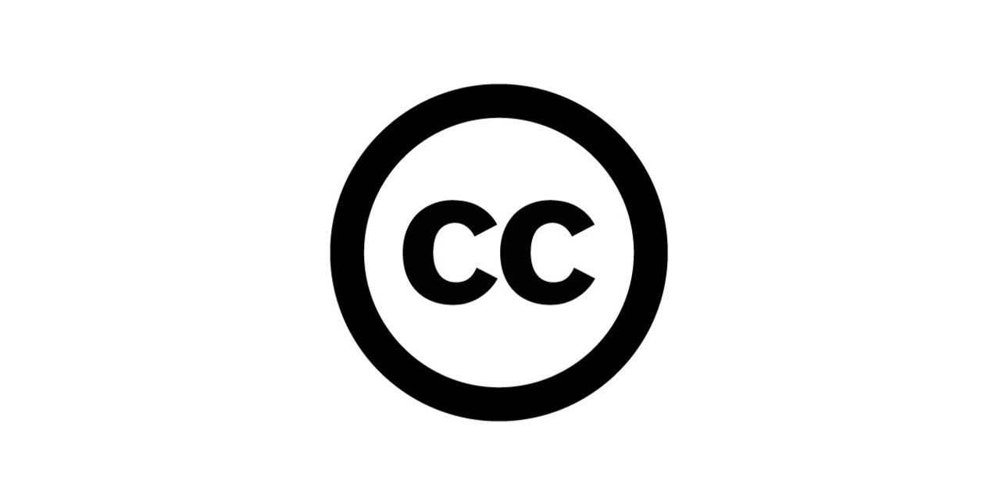

The GDL core platform will hold digital copies of Creative Commons or otherwise openly licensed, publicly accessible materials.

The primary licenses for the GDL will be CC BY and CC BY-SA. These licenses drive innovation and creativity – including commercial reuse. Furthermore, they strongly support the overall GDL goal of sharing, translation and contextualization of early grade reading educational materials, open textbooks and open educational resources. The GDL project will also accept other CC licenses.

We are collaborating with several content platforms who are addressing the increasing public demand for sharing under CC licenses, and for public domain tools. We encourage all projects developing content to visit [creativecommons.org](https://creativecommons.org/) for more information.

Creative Commons has developed a [cc toolkit](https://creativecommons.org/platform/toolkit/) for user-generated content platforms. This toolkit covers the elements for a basic Creative Commons platform integration, including aligning legal terms to CC tools; installing the CC license chooser; displaying CC licensed content with the correct logos and links; and how to communicate CC to your users.
post
