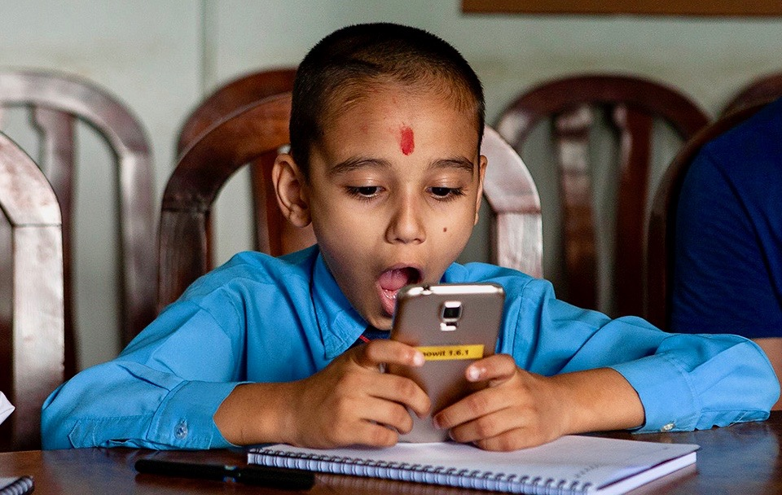

Creating a good and engaging user experience is the starting point for any development process in the GDL project. This demands user driven development processes, including a profound understanding of different user situations.

During the initial phase of the GDL project we conducted user tests of the translation tool and the early prototype of a mobile native app. To ensure relevant user feedback we conducted these user tests in Nepal and Ethiopia, two locations where the language represent different challenges for the GDL team developing the platform.

In the user testing of the mobile native app prototype, some of the things we looked for were very practical, including the following:

- Find an e-book, search, and user categories
- Download and organize books in “my books”
- Read a book, including the toggling between pages

We have also conducted user tests of the functionality in [Crowdin](http://www.crowdin.com/), a content translation platform that supports crowdsourcing and proofreading. This was the main purpose of our user testing workshop in Addis Ababa in June.

Some of the tests are recorded, to ensure that our development team can go back and look at the user tests at any point in the development process.

Example 1, child reading book on a mobile app

<video>
https://www.youtube.com/watch?v=XkOUJfxRGRg
</video>

Example 2, proofreading of Amharic.

<video>
https://www.youtube.com/watch?v=gGTZJFXuhwY
</video>
