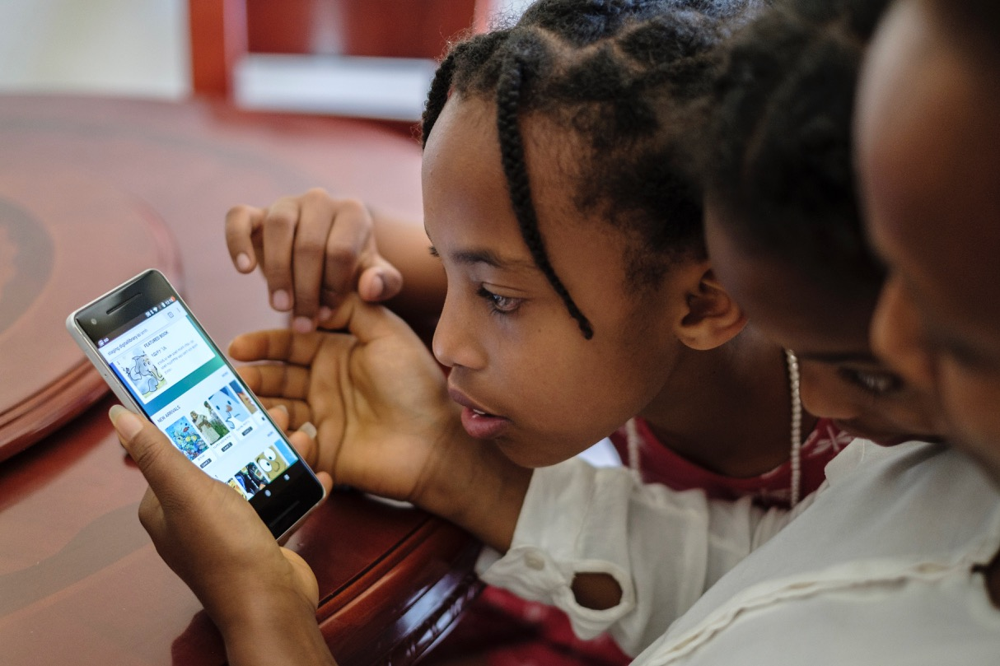

<video>
https://www.youtube.com/watch?v=VelE4DGzreg
</video>
The main objective of the user test in Ethiopia and Cambodia has been to discover weaknesses in the GDL web application. The focus has been on both technical weaknesses and on usability issues. The tests have been performed on both wireless networks and cellular networks in Addis Ababa and in a rural area outside of Phnom Penh Cambodia. Detailed descriptions have been given to test participants on what step to execute. The tests have been recorded using Lookback (https://lookback.io) where both, sound, screen, clicks and face has been recorded.

## User test highlights

### 1) Navigation to find book works well

All test subjects were successful in finding books and navigating to books on their language. All test subject was successful in navigating by using the menu. Som subjects did not understand the meaning of the menu icon.

### 2) Reading book

All test subjects were able to find a book and start reading by clicking the read button. All test subjects were able to navigate pages using click or swipe. All subject understood how many pages they had read and how many pages were remaining.

### 3) Close book

Nearly all test subjects had difficulties finding the close-book feature. In addition to this, the subjects who found the button had a difficulty clicking on it due to its positioning and size.

### 4) Download book

The test subjects did not understand the difference between ePub and PDF. Most of the test subjects selected PDF both for print and for reading later.

### 5) Load more

Users did not notice the load more feature.

### 6) Finding a specific book

When users were instructed to find a specific book, it was clear that a need for a search-function is essential.
