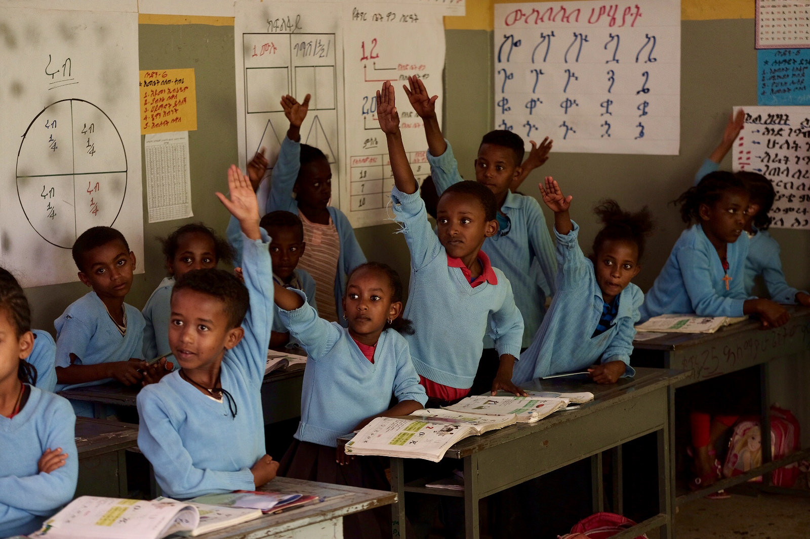
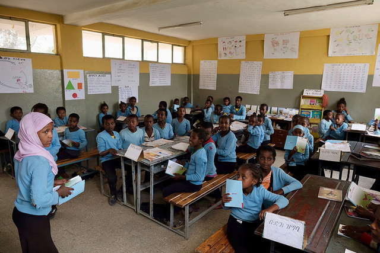
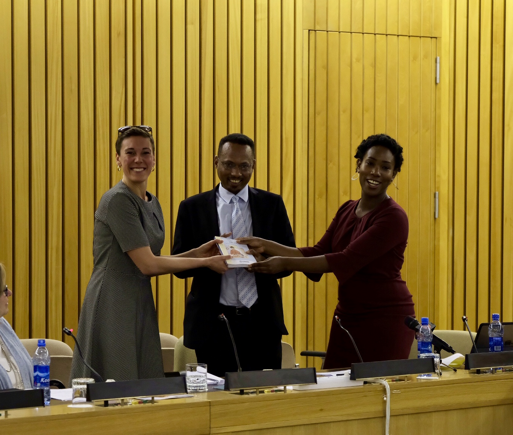

The GDL platform was launched on April 26 2018, with an initial total of 900 resources in 15 languages, including Kiswahili (Kenyan), Bangla, Hausa and 7 Ethiopian languages. The launch itself was a success, with various stakeholders showing great excitement around all the opportunities the GDL can represent in Ethiopia and elsewhere. The launch was planned and executed with the help from USAID Ethiopia and UNESCO-IICBA.

The GDL team is currently planning user testing in Kenya and Bangladesh in July and workshops in Cambodia in September 2018, in conjunction with/or leading up to World Literacy Day on September 8.

The design of the GDL has been based on a “mobile first” principle. At the time of the launch, the GDL platform included a website and a native app for Android, providing users with the option of:

- Reading the titles on their mobile, tablet or computer
- Downloading for print
- Downloading the mobile app, providing the user with extended offline capabilities
- Translating titles into more than 300 languages

## Quality assurance (QA) standards

The GDL team has developed [quality assurance (QA) standards](https://home.digitallibrary.io/qa/) for different content categories, in close cooperation with reading experts from USAID, GPE and URC. The standards have been approved by the GBA Steering Committee. These QA standards serve as minimum criteria for the acceptance or rejection of various types of reading books submitted for upload to the GDL. In terms of responsibility for verifying that content quality is in accordance with these standards, URC has the lead on this for Classroom resources, whereas the GDL-team organizes this for Library resources.

## Pictures from the Launch in Addis Ababa

