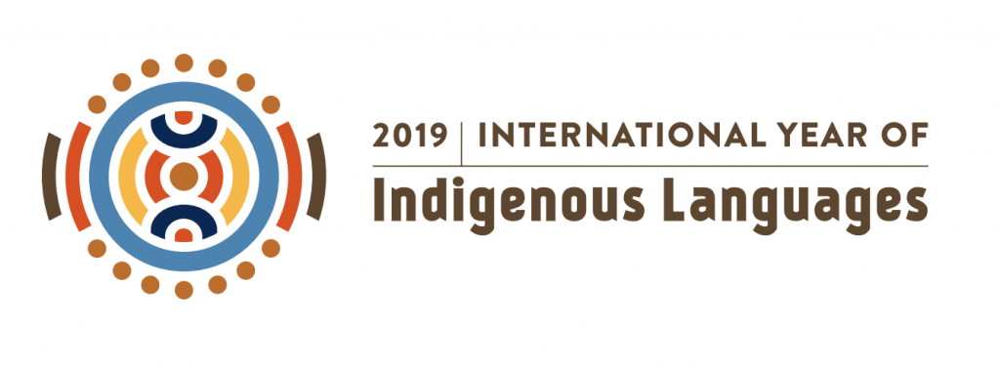
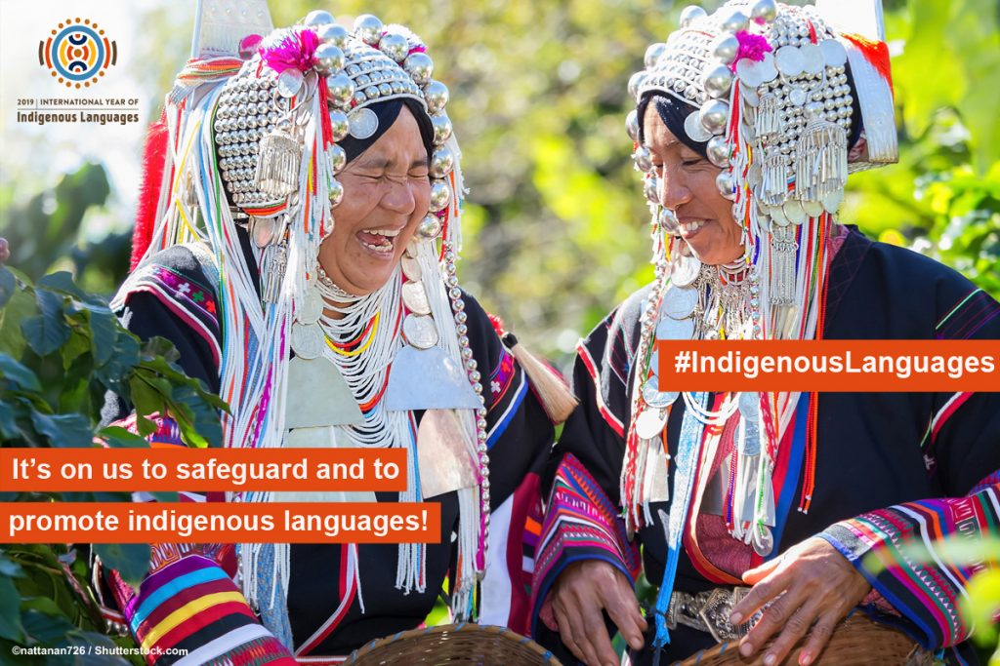
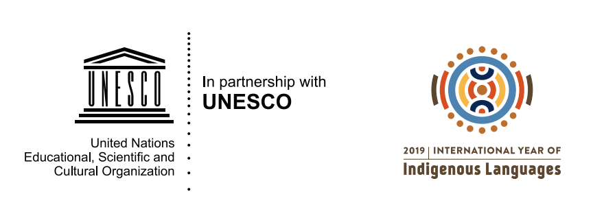

## Indigenous languages matter for social, economic and political development, peaceful coexistence and reconciliation in our societies. Yet many of them are in danger of disappearing. The United Nations declared 2019 the Year of Indigenous Languages in order to encourage urgent action to preserve, revitalize and promote them.

In partnership with UNESCO, the Global Digital Library supports this effort as we work to increase the availability of high-quality reading resources in indigenous languages worldwide.

The campaign has the following main goals:

- Support the UN efforts of the International Year of indigenous languages 2019
- Add more indigenous languages as translation target languages on the GDL platform
- Encourage local communities to organize translation workshops to translate books into indigenous languages

The world’s indigenous languages foster and promote unique local cultures, customs and values which have endured for thousands of years and these languages add to the rich tapestry of global cultural diversity. Without them, the world would be a poorer place.

However, despite their value, languages, especially indigenous languages, are continuing to disappear at an alarming rate due to a variety of factors. According to the Forum on Indigenous Issues, 40 per cent of the estimated 6,700 languages spoken around the world are in danger of disappearing. The fact that most of these are indigenous languages puts the cultures and knowledge systems to which they belong at risk.

## The GDL indigenous language campaign

The Global Digital Library supports underserved and indigenous languages by collecting existing high quality open educational reading resources, and making them available on web, mobile and for print. The GDL platform also supports translation into more than 300 languages, a number that is growing every month.

We want to support even more indigenous languages. If your local language is missing from the list of translation languages on the GDL, please fill out [this form with basic information](https://forms.gle/Vyn8SgdJHGWsjmE46), and we will work to add your language if possible.

We also want to encourage local communities to organize their own translation workshops [with the GDL platform](https://home.digitallibrary.io/translation-startup/). The translation capabilities on the GDL platform is a great opportunity for local communities to translate new books into indigenous languages.

Languages play an essential role in the daily lives of all peoples. Through languages, people not only embed their history, traditions, memory, unique modes of thinking and expression but more importantly construct their future. Languages are pivotal in the areas of peacebuilding, human rights enhancement, education, research, innovation, protection of the environment, and sustainable development.

## Who can use the Global Digital Library?

The GDL is aimed at many different types of users and the platform will be open for everyone. Intended users include ministries of education, school managers, teachers, donor agencies and their implementing partners, international and national non-governmental organizations, local publishers, digital distributors and content providers, and households in developing countries.

